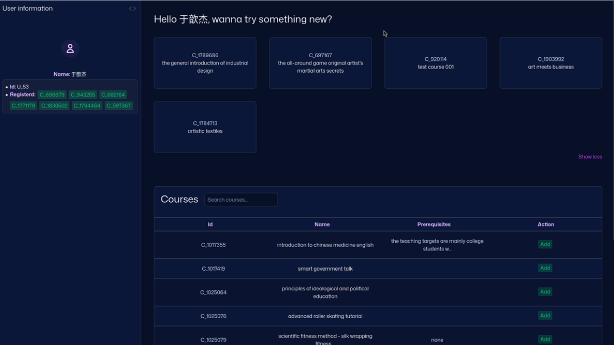

# Course Recommender using MOOCCubeX dataset (report)
> this repo 

## Team Members
| Name                | Roles  |
|---------------------|--------|
| Nguyễn Hữu Nam      | Leader |
| Vo Dinh Khanh    | Member |
| Nguyen Khanh  | Member |
| Nguyen Minh Son | Member |
| Bui Hong Son | Member |

## Demo

  
  
<em>Web demo</em>

## How it works:
- `docs`: contains final reports, web and cloud instruction
- `data`: contains test, raw and processed datasets
- `demo`: contains video demo about our projects
- `models`: all the model being used
- `notebooks`: all the notebooks being used to visualize, preprocess and feature engineering data
- `src`: contains code about running cloud
- `web`: contains code about frontend and backend of the website

